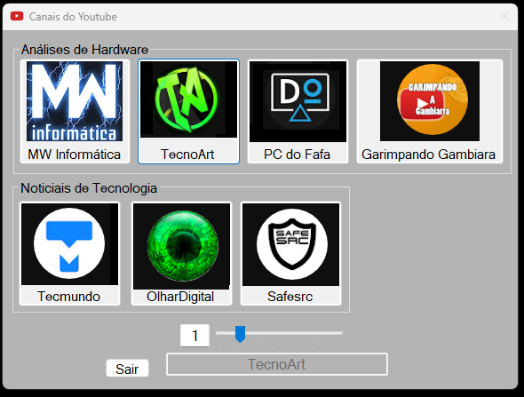

#### Meu Atalho de Canais para YouTuber ###

Convenhamos ficar toda vez abrindo o navegador para digitar Youtube ou o nome do canal é muito ruim. 
Daí resolvir cria um atalho para meus canais via executável que além de ir direto ao conteúdo clicando, fiz a adição de "ToolTip" aonde posso selecionar através dela e saber a localização do botão do canal ou simplesmente eu digitar o número no campo disponível para selecionar o botão do canal.
